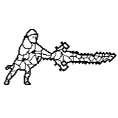

# [Play](https://deesdav.github.io/draezlyr-wielder/)

## [Play Draezlyr Sword Massacre](https://deesdav.github.io/draezlyr/)

about last update and what is added:
 - 2500 rows of js
 - added information about damage and health
 - reduced from 20 levels to 15
 - back buttons fix
 - mobile functionability

